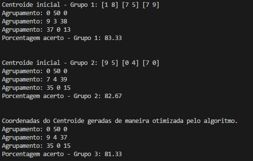
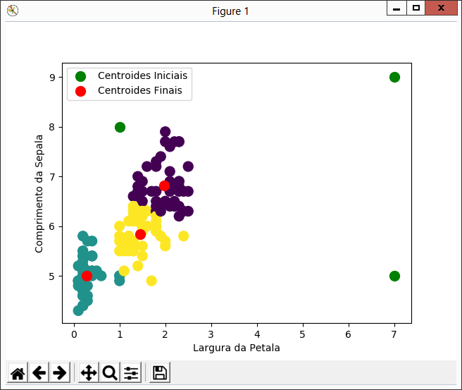
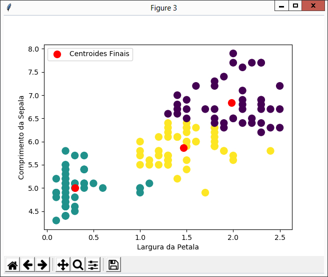

# trab-means
Utilizando o algoritmo K-means para analisar grupos de Irís (também chamadas de Lírios) com as libs Scikit e NumPy.

## Introdução
Utilizando um data set de 150 iris, sendo as mesmas dividídas em 3 tipos diferentes (), o objetivo era utilizar o algoritmo de aprendizado não supervisionado K-Means com apenas duas das quatro caracteristicas passadas.

## Metodologia
A lib que está sendo utilizada é a [Scikit-learn](http://scikit-learn.org/), projeto concreto e bem formalizado, criado em 2007 e que possui grande comunidade envolvida.

Utilizando Python, tanto a largura das Pêtalas e o comprimento das Sêpalas são armazenados em pares ordenados e assim passados como parâmetros para o algoritmo.

Cada vez que o script é executado, o k-means é executado três vezes, cada qual trazendo como resultado: os centroides iniciais e finais, um gráfico mostrando as flores em um plano cartesiano e qual grupo pertencem, além da porcentagem de acerto.

Nas duas primeiras execuções, são usados pontos aleatórios (entre 0 e 9) no plano para definição dos centroides iniciais. Durante a terceira e última execução, o centroide inicial é decidido pela própria biblioteca, no qual estima qual seria a melhor posição.

Ao final, são gerado 3 gráficos referentes a cada uma das execuções, mostrando a posição de todas as flores, os agrupamentos, e as posições iniciais (com excessão ao gerado pelo algoritmo) e finais dos centroides.

Cada gráfico é interativo, então é possivel dar zoom nas regiões e movimentá-lo da maneira como preferir.

## Considerações Finais
O código fonte está sendo distribuído sobre a licença MIT, então sinta-se livre para utilizar. Para executar o fonte acima, instale o Python 3 em sua máquina, clone o [repositório](https://github.com/Katreque/trab-means), instale as libs necessárias (scikit-learn, numpye matplotlib) e use o comando 'Python main.py'.

Qualquer dúvida, não deixe de abrir uma issue. Fonte: [GitHub/Katreque](https://github.com/Katreque/trab-means)